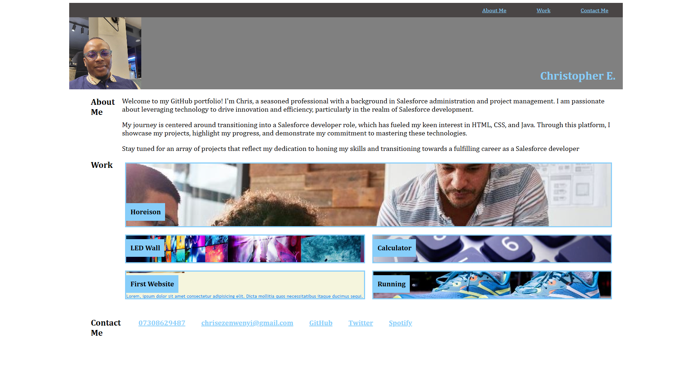

# myPortfolio
Personal Portfolio site including a bio, links to projects I've worked on and my contact details.
 
 Links to the deployed Page:
[Deployed page on GitHub Pages](https://christopher-eze.github.io/myPortfolio/)
 
 Screenshot:
